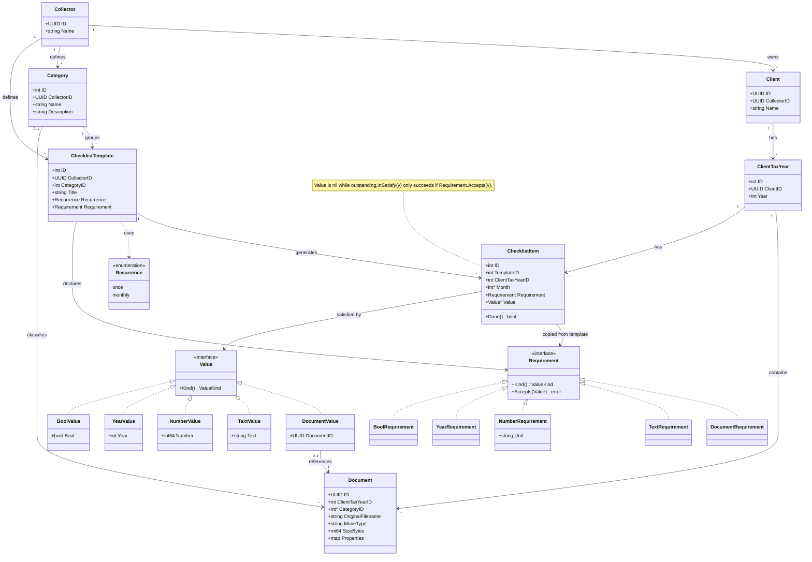

# tax-return-organizer

>>This repo is still WIP

This repository hold services to help you organize documents for your tax return. It is used by two personas:

1. The collector: defines which documents and information a client must provide
2. The client: uploads the files and enters necessary data

### Personas & tenancy

This is a multi-tenant (SaaS-style) system: there can be many collectors (e.g. different tax advisories), each managing their own set of clients. A client belongs to exactly one collector. Categories and checklist templates are defined by a collector and reused across that collector's own clients; tax years, documents, and checklist item completions each belong to one specific client.

## Usage by collector

- Setup checklist categories and templates describing the necessary data and files (including metadata)
    - Private finances: bank statements, ETFs, savings accounts, ...
    - Work: salary statements, number of homeoffice days, ...
    - Insurance: premium notices, ...
    - Real Estate: bank statements, loan amounts, ...
- Define if a checklist item is required once per tax year or recurring monthly

## Usage by client

- See the files/information necesary to provide for each year
- Upload files and set necessary metadata
- Enter structured data directly on a checklist item (e.g. a count or amount), satisfying that item in place of uploading a file
- See at a glance which checklist items are still outstanding (not yet satisfied)
- package/export files and data to send to tax office
    - include files metadata into the export (how needs to be evaluated)

**Not in the first MVP:** deadline tracking and upcoming/overdue notifications. The first MVP only tracks whether an item is satisfied or not; due dates and notifications are deferred to a later iteration.

## Domain model

The Go backend's core domain types and how they relate:

Notes:
- For the first MVP, `ChecklistItem` has no due date — it's only tracked as satisfied (`Done`) or not. The UI simply highlights outstanding items; deadline tracking is deferred (see "Not in the first MVP" above).
- The collector declares on each `ChecklistTemplate` what satisfies it via a `Requirement`: `DocumentRequirement` (an uploaded file), or a typed value requirement — `TextRequirement`, `NumberRequirement` (with an optional display `Unit`, e.g. "days", "EUR"), `YearRequirement`, `BoolRequirement`. `Requirement` and `Value` are sealed interfaces (only the domain package implements them), so a type switch over the concrete types is exhaustive.
- Generated items copy the template's `Requirement`, so an item alone says what it needs and later template edits don't affect items already filled in. `ChecklistItem.Value` is `nil` while the item is outstanding; `Done()` is derived from it, so there's no separate flag to drift out of sync.
- `item.Satisfy(v)` succeeds only if `Requirement.Accepts(v)`: a value of the wrong kind is rejected (`ErrWrongFulfillmentKind`), a right-kind value that breaks a rule (e.g. a year out of range) too (`ErrInvalidValue`). Only value types are accepted (a pointer such as `&TextValue{}` is rejected as the wrong kind). An item satisfied through `Satisfy` therefore always holds a value matching its requirement, and never both a document and a value. `Value` is an exported field so persistence adapters can rehydrate items, which bypasses `Accepts`; application code must go through `Satisfy`.
- Values are typed, not strings. Turning raw input (form fields, JSON) into a `Value` is the inbound adapter's job. `NumberValue` is a plain `int64`. Adapters persist `Kind()` as the discriminator column next to the value.

## Architecture

We use a Go backend and a SvelteKit BFF, backed by a PostgreSQL database. They are shipped as three docker containers orchestrated in docker compose. Documents and their metadata as well as standalone data objects are stored in PostgreSQL, not on the filesystem.

### Go backend

- Hexagonal architecture
- storing the collectors models
- Storing clients data and documents (as blobs) and their metadata in PostgreSQL, via a Postgres outbound adapter (kept swappable per hexagonal arch, in case storage moves elsewhere later)
- Exposing REST API for the BFF to call
- Auth is intentionally left out for now — deferred until upload/classify/store/export work end-to-end

### SvelteKit BFF

- collector page
- client page

### Docker compose

- NodeJS container with bff
- Plain container with compiled backend binary
- postgres container, with a named docker volume mounted at `/var/lib/postgresql/data` (Postgres' `PGDATA` dir), so the database (and thus the documents stored as blobs in it) persists across container restarts/recreation — without it, `docker compose down` would wipe all data
- Only the Go backend container talks to postgres directly