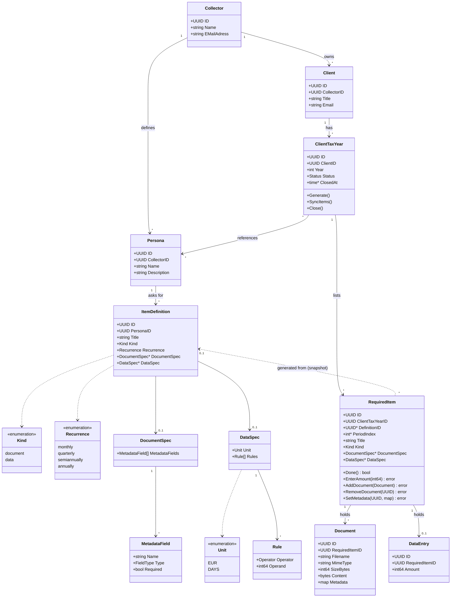

# tax-return-organizer

>>This repo is still WIP

This repository hold services to help you organize documents for your tax return. It is used by two personas:

1. The collector: defines which documents and information a client must provide
2. The client: uploads the files and enters necessary data

### Personas & tenancy

This is a multi-tenant (SaaS-style) system: there can be many Collectors (e.g. different tax advisories), each managing their own set of Clients. 

## Usage by Collector

### Usecase *"Setup a Collector account"*:

- Give a name
- Give email address

### Usecase *"Create Client Personas"*:

- Client Personas represent the documents and information a client has to provide, if they do things, that are tax relevant
- Examples would be *Employed*, *Letting*, *Self-employed* or *ETF investing*
- The collector defines which documents and data (in form of defined structural data) the Personas need to provide and if the data needs to be provided monthly, quarterly, semi-annualy or annualy
- Some Client Personas should come preconfigured as templates

### Usecase *"Create a Client"*:

- Create a client object with a title and an email address

### Usecase *"Create Client Tax Year"*:

- Select a Client
- Enter a year (e.g. 2021)
- Assign Personas to this Client
    - The Personas are only referenced, so a change in a Persona object immediately reflecs on the Client
- Generate List of documents and data the Client needs to provide
    - For documents metadata can be specified, which the client needs to fill out
    - For data units (EUR or DAYS) and validation rules (e.g. *>0*) can be specified
- If Persona changes, add possibility to update this list, but not necessity (not possible on a closed tax year)

### Usecase *"Close Client Tax Year"*:

- The Collector can only close the tax year once every item is satisfied; while items are outstanding, closing is rejected
- After this the client cannot alter the files/data anymore

## Usage by Client

### Usecase *"View tax year"*:

- The Client needs to see all files and data they need to provide for a tax year
- They should not see the *Persona* layer, only the documents and data
- They need to see which items are still open and which are satisfied

### Usecase *"Upload files"*:

- For each item in the list a Client must be able to upload one or multiple files
- After upload the files must be rendered in the UI so the Client can check them
- Clients must be able to delete files
- Clients must be able to download files
- Only after uplaod Clients must be able to set and edit documents metadata

### Usecase *"Enter data"*:

- For standalone data required by the Persona, the Client must be able to enter it
- If there are validation rules, they are applied in the UI and on save

**Not in the first MVP:** 

- deadline tracking and upcoming/overdue notifications. The first MVP only tracks whether an item is satisfied or not; due dates and notifications are deferred to a later iteration.
- Authentication

## Domain model

The Go backend's core domain types and how they relate:

Notes:
- **Persona assignment is a live reference, generated items are snapshots.** A `ClientTaxYear` only references its `Persona`s, so renaming a persona or adding a definition shows up on the client immediately. `Generate()` expands each `ItemDefinition` of each assigned persona into `RequiredItem`s (12 for `monthly`, 4 `quarterly`, 2 `semiannually`, 1 `annually`, distinguished by `PeriodIndex`) and copies title, kind and spec into the item. Later edits to a persona therefore never silently change an existing list; `SyncItems()` is the explicit, optional way to pull in new definitions (it only adds items and leaves existing ones untouched).
- **The client never sees personas.** A `RequiredItem` carries everything needed to render it (title, kind, spec, state), so the client view works on items alone. `DefinitionID` is only a back-reference used by `SyncItems()`.
- **Two kinds of items.** `document` items are satisfied by uploaded `Document`s, `data` items by a single `DataEntry` whose numeric `Amount` is in the `DataSpec.Unit` (EUR is stored in cents). `Done()` is derived, there is no separate flag: documents → at least one `Document`; data → a `DataEntry` exists.
- **Validation.** `EnterAmount` creates or replaces the item's `DataEntry` (at most one per item) after checking the value against `DataSpec.Rules` (e.g. `> 0`); a violation returns `ErrInvalidValue`. The UI applies the same rules, the backend is authoritative. `SetMetadata` checks the map against `DocumentSpec.MetadataFields` (known fields, types, required fields). Metadata lives on the `Document`, so it can only be set after the upload.
- **Multiple files per item.** An item can hold any number of documents; documents can be deleted and downloaded individually.
- **Closing.** `Close()` is a collector action and is blocked while any `RequiredItem` is not `Done()`: it fails with `ErrItemsOutstanding`. Once `Status` is `closed`, `SyncItems`, `EnterAmount`, `AddDocument`, `RemoveDocument` and `SetMetadata` fail with `ErrTaxYearClosed`.
- **One tax year per client and year** (unique `ClientID` + `Year`).
- For the first MVP there are no due dates: items are only tracked as done or not, and the UI highlights outstanding ones (see "Not in the first MVP" above).
- Persistence: `Kind` is stored as discriminator, `DocumentSpec`/`DataSpec` and `Metadata` as JSONB; document content as a blob (see Architecture).

## Architecture

We use a Go backend and a SvelteKit BFF, backed by a PostgreSQL database. They are shipped as three docker containers orchestrated in docker compose. Documents and their metadata as well as data entries are stored in PostgreSQL, not on the filesystem.

### Go backend

- Hexagonal architecture
- storing the collectors models
- Storing clients data and documents (as blobs) and their metadata in PostgreSQL, via a Postgres outbound adapter (kept swappable per hexagonal arch, in case storage moves elsewhere later)
- Exposing REST API for the BFF to call
- Auth is intentionally left out for now — deferred until upload/store/export work end-to-end

### SvelteKit BFF

- collector page
- client page

### Docker compose

- NodeJS container with bff
- Plain container with compiled backend binary
- postgres container, with a named docker volume mounted at `/var/lib/postgresql/data` (Postgres' `PGDATA` dir), so the database (and thus the documents stored as blobs in it) persists across container restarts/recreation — without it, `docker compose down` would wipe all data
- Only the Go backend container talks to postgres directly